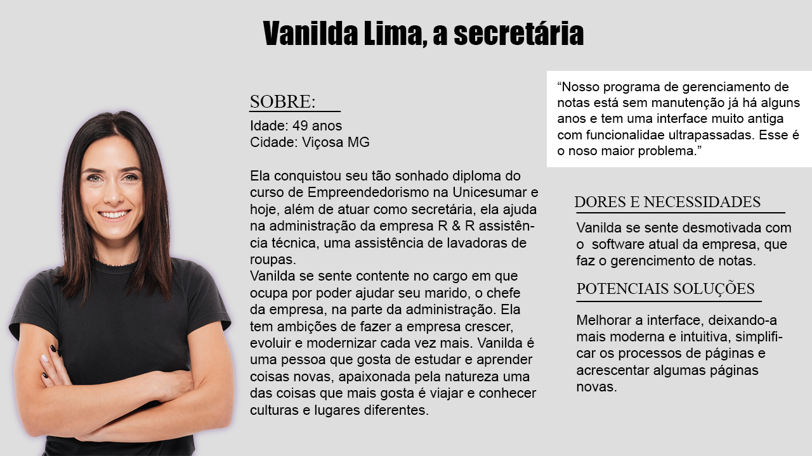
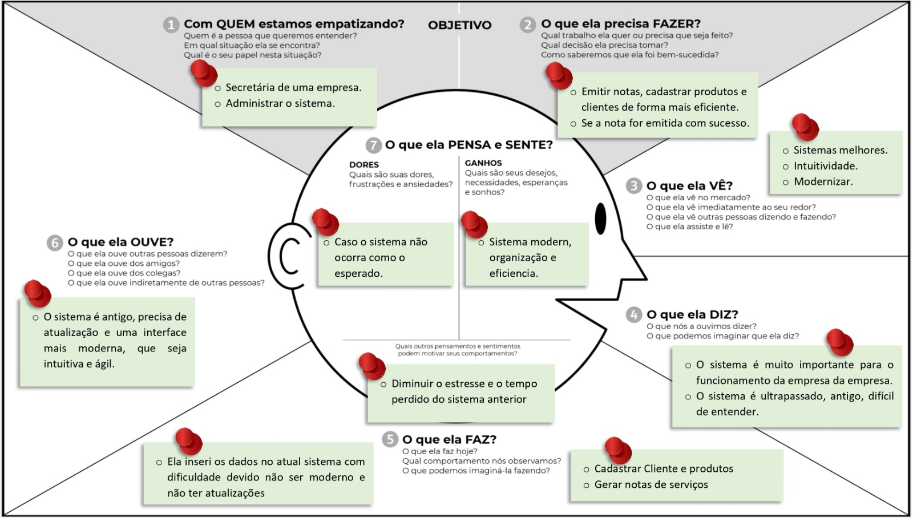
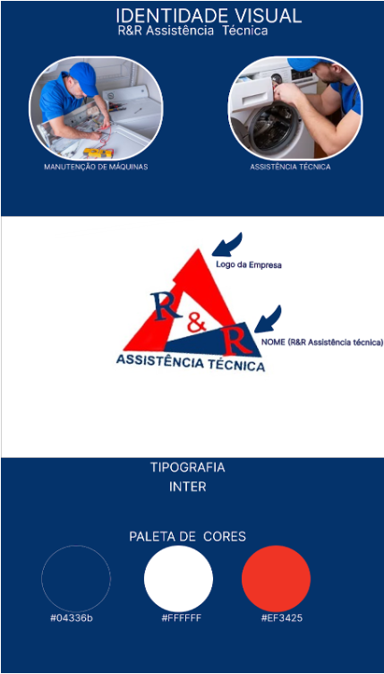
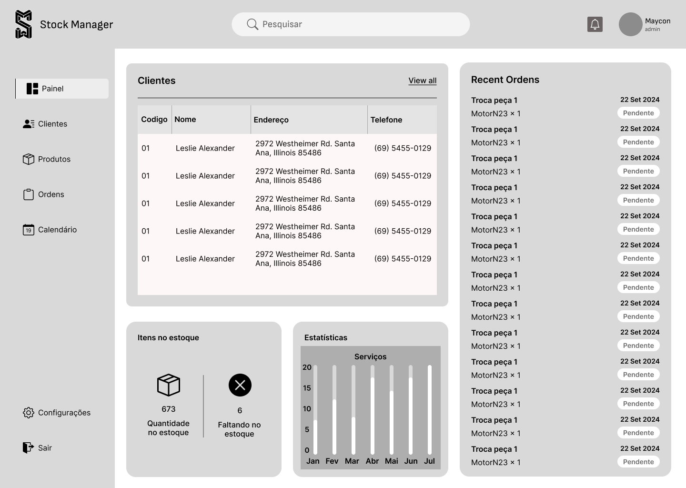
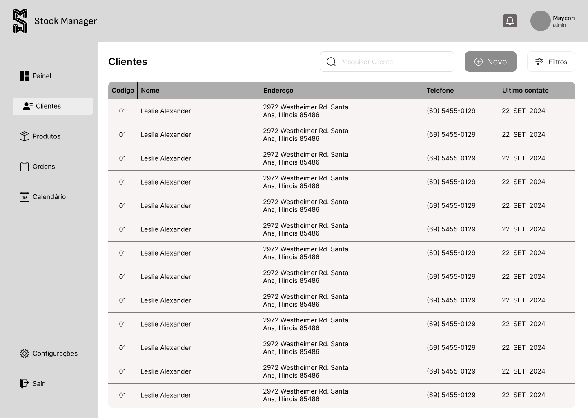
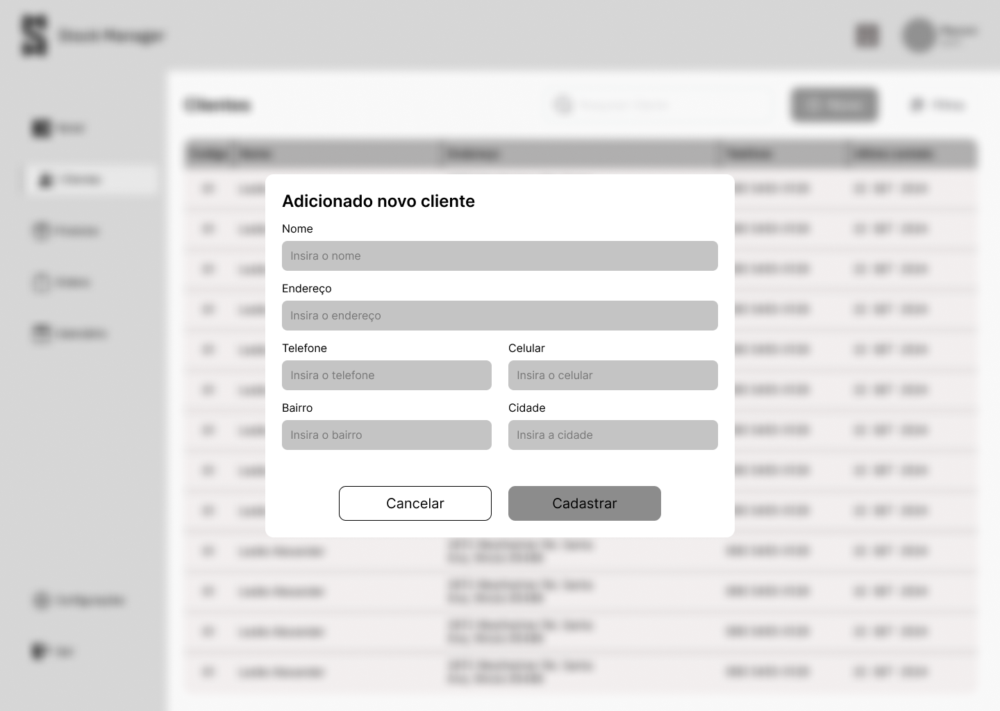
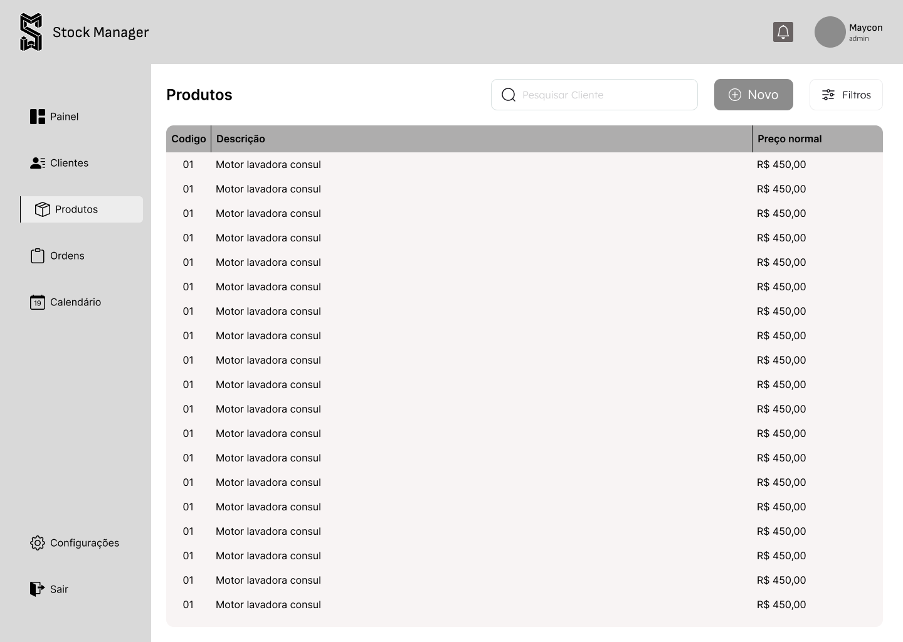
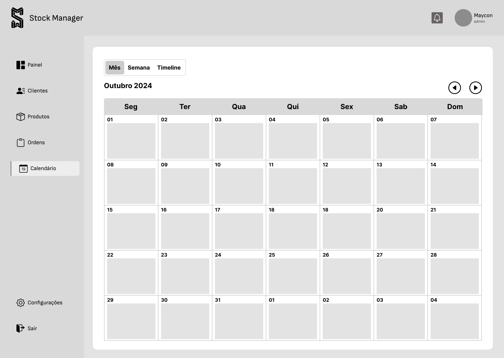
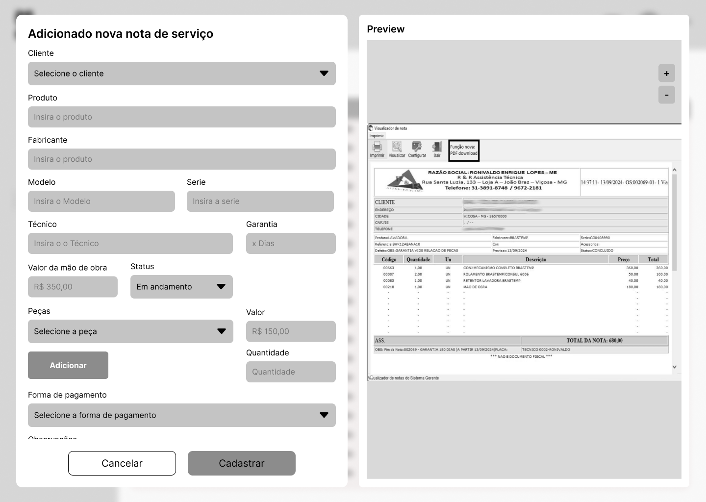
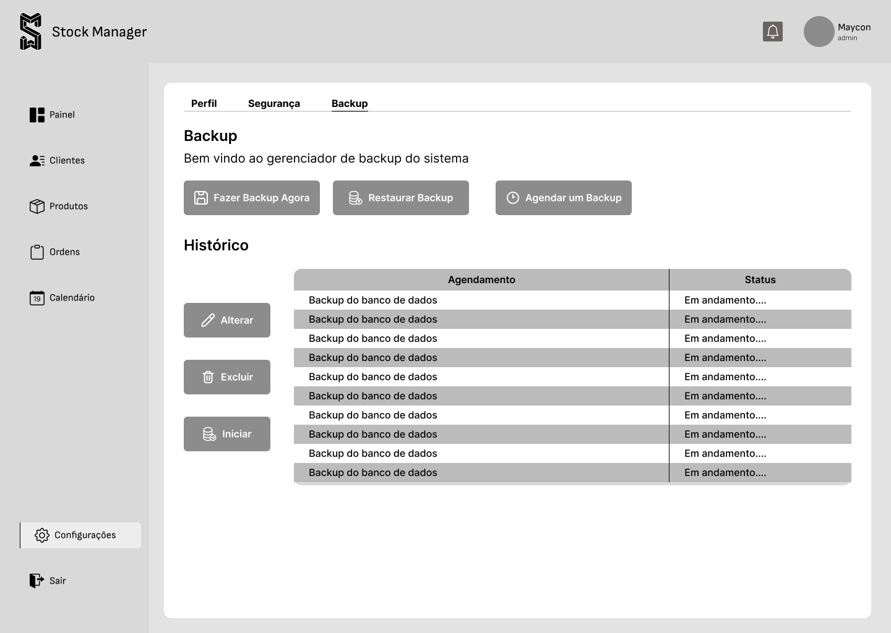

# Redesign de Interface R&R Assistência Técnica

   

 Figura 1 - Logo da R&R Assistência Técnica

# Visão Geral
## O desafio
Idealizar e prototipar um sistema de software já existente tornando-o mais intuitivo e mais moderno, visto que o sistema está abandonado e sem manutenção e possui uma interface muito antiga. Esse software é utilizado na empresa R&R Assistência Técnica para gerenciamento de notas de serviços.

## Contexto
Atualmente a R&R Assistência Técnica possui um software de gerenciamento de notas para realizar a emissão de notas de serviços e garantia para os serviços feitos pelo técnico da loja. Entretanto, este software está defasado por não ter uma manutenção correta e por possuir um design bem antigo, além de diversas funções existentes nele que não são utilizadas.
Percebemos que poderiam ser feitas melhorias tanto na parte visual, quanto na parte da reformulação do sistema como um todo. Simplificando e retirando tudo aquilo que não é utilizável e deixando o que de fato é utilizado de forma mais organizada e intuitiva.

# WHY?
## Quem utilizará o sistema
Inicialmente, Luiz Filipe de Souza Oliveira, o product owner da equipe, contatou a empresa para oferecer nosso serviço de Design. Em uma reunião com o CEO da empresa, Ronivaldo Enrique Lopes, fomos direcionados à secretária, usuária do software, que nos apresentou o programa e descreveu suas dificuldades e insatisfações.
### Quais seriam os problemas?
  - Interface muito antiga, tendo como forma de manuseio, somente o teclado;
  - Programa com cores que não combinam com a empresa;
  - Funções saturadas, procedimentos com pouca interatividade com o usuário;
  - Por ter uma interface pouco intuitiva, os procedimentos demandam mais tempo para serem concluídos.

## Storytelling
“Há alguns meses a Vanilda Lima, secretária e a responsável por administrar a loja R&R Assistência Técnica, começou a perceber que os lugares em que ela frequentava, grande parte das lojas e oficinas utilizam de softwares para facilitar o gerenciamento da loja e emissão de notas. Ela percebeu também que aqueles softwares pareciam ter sido feitos de formas mais condizentes às necessidades das empresas e de forma específica, o que não era o seu caso, visto que o software utilizado na loja é genérico . Sendo assim,  pensando na flexibilidade e organização de seu local de trabalho, sentiu-se a vontade de ter um programa que fizesse realmente aquilo que ela precisa, pois facilitaria ainda mais a sua vida.

Com o tempo, ela passou a pensar mais na possibilidade de automatizar processos na loja para facilitar a administração. Observando o avanço tecnológico centrado ao usuário e a rapidez com que o tempo parece passar, percebeu que precisava otimizar seu tempo para outras tarefas. Seu desejo era usar a tecnologia para organizar a loja de forma mais eficiente, aumentando sua produtividade.

Em um certo dia, houve a oportunidade da equipe Maycosoft chegar até a Vanilda e através de uma reunião com os membros ela percebeu a oportunidade passando em sua porta. Através de uma conversa, apresentamos um projeto para solucionar aqueles problemas na qual ela enfrentava. Era imprescindível, a princípio, compreender os requisitos e conhecer o programa que ela vinha utilizando para entender o seu funcionamento, a fim de propor uma solução.

Após analisar o programa, percebemos que, além de ter uma interface antiga, continha várias funcionalidades desnecessárias e ainda era escasso de recursos importantes para o gerenciamento da loja. Identificamos a necessidade de simplificar o software, atualizar a interface e desenvolver, junto com ela, as funcionalidades desejadas.

Por fim, como todas as histórias, conseguimos chegar a um acordo e encontrar uma solução para aqueles problemas. Reformulamos os caminhos de cada funcionalidade, retiramos tudo aquilo que não fazia parte do gerenciamento, daquela empresa em específico, e criamos uma interface mais intuitiva com as cores desejadas pela secretária, que era seguindo as cores da logomarca da empresa.

De frustração a eficiência e intuitividade, tentando ao máximo gerar uma boa experiência ao usuário, criamos o projeto e apresentamos a empresa cliente. Eles ficaram satisfeitos com os resultados e aguardam ansiosamente a implementação. Essa experiência mostra que reformular um sistema que não atende bem às necessidades do cliente, focando na usabilidade, pode gerar maior satisfação e conforto.”

# WHO?

## Persona

Com base nas hipóteses, storytelling e pesquisa com o usuário, nós criamos a persona para representar a secretária que irá utilizar do produto modificado:

   

 Figura 2 - Persona

## Mapa de Empatia
Na intenção de entender as necessidades e as perspectivas da nossa cliente, se colocando no lugar dela, foi desenvolvido em sala de aula um mapa de empatia considerando a persona que foi criada.

   

 Figura 3 - Mapa de Empatia

## Requisitos 
**1.Interface visual moderna e intuitiva:**

*A interface deverá ser redesenhada para ser mais fácil de utilizar.*
*Utilizar as mesmas cores já disponíveis na empresa.*

**2. Adição de navegação por mouse:**

*Implementar a funcionalidade para navegar pela interface com o mouse.*

**3. Implementar a funcionalidade de busca de mercadorias:**

*Adicionar a opção de buscar produtos no estoque a partir do nome ou do ID.*

**4. Geração de nota de garantia e serviço:**

*Após a geração da nota e/ou serviço, inserir um botão para gerar o PDF e enviá-lo ao cliente.*

**5. Modificação de campos na geração da nota:**

*Remover a opção de “Cor” na nota. Adicionar um campo de “Observações” na nota para permitir a inserção de mais informações.*

## Identidade Visual
A Identidade visual do sistema foi inspirada nas cores e na logomarca da R&R Assistência Técnica,com algumas adaptações criativas para harmonizar com o estilo visual desejado. A paleta de cores foi baseada nos tons característicos da empresa, mas sofreu ajustes que foram da paleta de cor roxa( Sendo essa a cor inicial ). Para a de cor azul para atender uma estética personalizada e única de acordo com o gosto do nosso cliente.

   

 Figura 4 - Identidade Visual

## Wireframe
Ao longo da trajetória da empresa Maycosoft, foram desenvolvidos protótipos de baixa fidelidade no (Figma), incorporando as funções essenciais do sistema. Este protótipo foi criado com foco na validação inicial do conceito e fluxo de usuário, servirá de base sólida para o desenvolvimento de um protótipo de alta fidelidade. A transição para alta fidelidade permitirá a exploração mais detalhada da interface, incluindo elementos visuais refinados, interações mais complexas e uma experiência de usuário mais imersiva com o protótipo de alta fidelidade, pretendemos testar a usabilidade em um contexto mais próximo da realidade, coletando feedback essencial para garantir uma experiência intuitiva e eficiente para os usuários finais.
  
A interface inicial oferece duas funcionalidades essenciais para a navegação do usuário: acesso à plataforma e registro. A funcionalidade de acesso permite que usuários cadastrados entrem em suas contas usando nome de usuário e senha. Já a funcionalidade de registro possibilita a criação de novas contas para usuários que ainda não estão cadastrados na plataforma.

 Após o login bem-sucedido, o usuário acessa o painel principal, uma central de controle que disponibiliza quatro módulos funcionais: gerenciamento de clientes, catálogo de produtos, acompanhamento de pedidos.

A função de Gerenciamento de Clientes exibe uma lista completa dos clientes cadastrados. Cada cliente é representado por seu código único, nome, endereço completo, número de telefone e data do último contato. Além disso, este módulo permite o cadastro de novos clientes, facilitando a expansão da base de dados.

A seção de Catálogo de Produtos apresenta uma listagem completa, contendo o código de identificação único de cada produto, sua descrição detalhada e o respectivo preço de venda e que também permite o cadastro de novos produtos.
A área  de Acompanhamento de Pedidos exibe uma lista de todas as notas de serviço emitidas, detalhando o código de cada nota, o nome do cliente associado, o status atual do pedido (pendente, em andamento, concluído), o valor total, e data de emissão. Este módulo também oferece funcionalidades para criação de novas notas de serviço.

O módulo de Calendário permite a visualização de datas em três perspectivas distintas: mensal, semanal e anual, oferecendo flexibilidade na organização e consulta de informações cronológicas,o calendário tem também a funcionalidade para ver os serviços que precisam ser feitos novamente (serviços recorrentes) .

A seção de Configurações permite o acesso ao perfil do usuário para gerenciamento de dados pessoais, às configurações de segurança da conta e às ferramentas de backup e recuperação de dados.

## Wireframe Completo
### Interface Inicial:
   

   

 Figura 1 -Aqui o usuário faz login com o seu nome e a sua senha.
 

### Interface de Dashboard:

   

 Figura 6 - Dashboard

### Interface de visualização dos clientes:

   

 Figura 7 - Tela de visualização de clientes

### Interface de adição de novo cliente:

   

 Figura 8 - Tela adicionar novo cliente

### Interface de visualização de produtos:

   

 Figura 9 - Tela Produtos

### Interface de visualização de calendário:

   

 Figura 10 - Tela de Calendário

### Interface de nota de serviço:

   

 Figura 11 - Tela adicionar nova nota de serviço

### Interface da tela de backup:

   

 Figura 12 - Tela de Backup

## Protótipo de alta fidelidade
Facilita a visualização de como o sistema funcionará na prática, permitindo que ajude o cliente pensar em melhorias ou alterações antes da etapa de desenvolvimento, garantindo que todas as funções do sistema atendam às necessidades dos usuários.

**Design Visual e Layout das Telas**

Através do figma realizou-se a criação das telas de login, cadastro de produtos e clientes, listas e busca, e envio de notas, com um layout intuitivo e moderno.

<a href="https://www.figma.com/proto/qBblvwZG3D7UGILCJ8Zh0n/Design-R%26R?node-id=478-621&scaling=min-zoom&content-scaling=fixed&page-id=472%3A710&starting-point-node-id=478%3A621" target="_blank">Interface de Alta Fidelidade </a>

## Processo contínuo
 As sequências de ações para completar o projeto seriam:
Iniciamos o processo de refino da interface, criando telas e animações restantes para melhorar visual e usabilidade do sistema. A criação das telas faltantes e adição de animações garantem fluidez e usabilidade agradável. Testamos tudo para garantir facilidade e intuitividade de uso. Há ajustes finais, mas o progresso é substancial.

Organizamos o Trello, deixando o quadro de tarefas claro e organizado. A organização facilita o acompanhamento do projeto e seu status. Esta etapa está quase concluída.

Iremos escrever o texto que resume o projeto, destacando conquistas e resultados obtidos. O foco é clareza e demonstração do sucesso do trabalho.

Revisamos todo o texto para corrigir erros de digitação, gramática ou clareza. Buscamos um texto bem escrito e fácil de entender, livre de erros. Esta etapa de checagem está quase finalizada.

Transferimos documentos e códigos para o GitHub para facilitar o trabalho em equipe e garantir acesso aos arquivos atualizados. A transferência para o repositório está quase concluída.

<a href="https://drive.google.com/file/d/1CkTfOk3pIiZ_FXGgSiVQQI4GnXnkIZFp/view?usp=sharing"> Video Explicativo do protótipo</a>

## ✅ Conclusão
Sob a orientação da professora Cristiane Aparecida Lana, tivemos a oportunidade de finalizar a primeira parte do Projeto Integrador, no qual desenvolvemos um protótipo de um sistema para atender as demandas da R & R Assistência Técnicas (Roni & Refrigeração Assistência Técnicas). Foi uma experiência muito prática e enriquecedora, que nos permitiu vivenciar de perto os processos de design do desenvolvimento de software. O foco principal foi na etapa de prototipação, e passamos por todas as fases, desde a documentação até o design final do sistema. Trabalhamos de forma colaborativa, simulando a criação da empresa fictícia Maycosoft, o que trouxe um ambiente dinâmico e realista. Cada integrante da equipe assumiu papéis como CEO, Scrum Master, Analista de Sistemas, Product Owner e Designer, o que nos ajudou a entender melhor como cada função contribui e qual a importância de cada responsabilidade no sucesso do projeto. Essa integração nos fez enxergar na prática o valor de trabalhar juntos e o impacto de cada contribuição individual.

## 🤝 Colaboradores do projeto

<table>
  <tr>
    <td align="center">
      
       
      <b>Maycon Araújo</b> - <a href="https://github.com/M4yc" target="_blank">M4yc</a>
    </td>
    <td align="center">
      
       
      <b>Vanessa Barros</b> - <a href="https://github.com/Vanessab4rros" target="_blank">Vanessab4rros</a>
    </td>
    <td align="center">
      
       
      <b>Taís Moreira</b> - <a href="https://github.com/TaisMoreir" target="_blank">TaisMoreir</a>
    </td>
    <td align="center">
      
       
      <b>Luslene Soares</b> - <a href="https://github.com/luslene" target="_blank">luslene</a>
    </td>
    <td align="center">
      
       
      <b>Luiz Filipe Souza</b> - <a href="https://github.com/LuizFilipe16" target="_blank">LuizFilipe16</a>
    </td>
  </tr>
</table>
