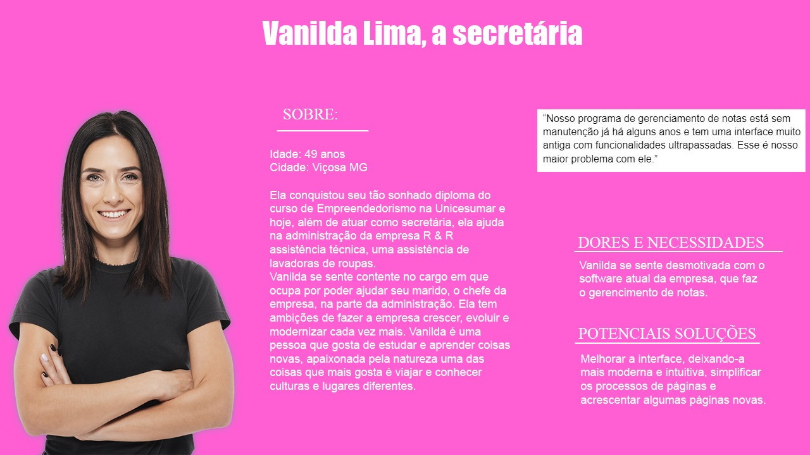
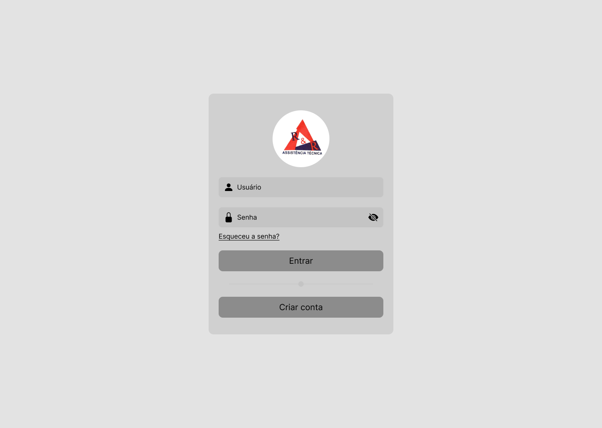

# Redesign de Interface R&R Assistência Técnica

   

 Figura 1 - Logo da R&R Assistência Técnica

# Visão Geral
## O desafio
Idealizar e prototipar um sistema de software já existente tornando-o mais intuitivo e mais moderno, visto que o sistema está abandonado e sem manutenção e possui uma interface muito antiga. Esse software é utilizado na empresa R&R Assistência Técnica para gerenciamento de notas de serviços.

## Contexto
Atualmente a R&R Assistência Técnica possui um software de gerenciamento de notas para realizar a emissão de notas de serviços e garantia para os serviços feitos pelo técnico da loja. Entretanto, este software está defasado por não ter uma manutenção correta e por possuir um design bem antigo, além de diversas funções existentes nele que não são utilizadas.
Percebemos que poderiam ser feitas melhorias tanto na parte visual, quanto na parte da reformulação do sistema como um todo. Simplificando e retirando tudo aquilo que não é utilizável e deixando o que de fato é utilizado de forma mais organizada e intuitiva.

# WHY?
## Quem utilizará o sistema
No primeiro momento, o primeiro membro da equipe a ser product owner, entrou em contato com a empresa oferecendo o nosso serviço de Design. Houve então uma reunião com o dono da empresa, ele nos encaminhou para a secretária, que é a pessoa que utiliza o software. Com isso ela nos apresentou o programa e quais eram as dificuldades e as insatisfações.
### Quais seriam os problemas?
  - Interface muito antiga, tendo como forma de manuseio, somente o teclado;
  - Programa com cores que não combinam com a empresa;
  - Funções saturadas, procedimentos com pouca interatividade com o usuário;
  - Por ter uma interface pouco intuitiva, os procedimentos demandam mais tempo para serem concluídos.

## Storytelling
"Há alguns meses a secretária Vanilda, a responsável por administrar a loja R&R Assistência Técnica, começou a perceber que os lugares em que ela frequentava, grande parte das lojas e oficinas utilizam de softwares para facilitar o gerenciamento da loja e emissão de notas. Como ela também utiliza um, ela acabava reparando os programas de outras lojas, e com isso ela percebia que os softwares eram mais modernos, mais fácil de manusear e mais simples que a de seu serviço. E percebeu também que aqueles softwares pareciam ter sido feitos pensado nas necessidades das empresas de forma específica, o que não é o seu caso, visto que o software da R&R é genérico e pode ser usado para várias lojas. Sendo assim, ela percebeu que se no seu local de trabalho tivesse um programa que fizesse realmente aquilo que ela precisa fazer facilitaria ainda mais a vida dela.

Os dias foram se passando e ela trabalhando cada vez mais pensando na possibilidade de automatizar ainda mais o que precisa ser organizado na loja, para facilitar sua administração, visto que, nessa era da tecnologia há muita informação e com isso ela relatou que dá impressão de que o tempo está passando mais rápido, e ela precisava de ganhar mais tempo para resolver outras coisas. Sendo assim, ela tinha esse desejo de conseguir fazer a máquina trabalhar e ajudar ela na organização das coisas da loja. Na cabeça dela isso otimizaria o tempo dela e aumentaria a produtividade."

# WHO?

## Persona

Com base nas hipóteses, storytelling e pesquisa com o usuário, nós criamos a persona para representar a secretária que irá utilizar do produto modificado:

   

 Figura 2 - Persona

## Mapa de Empatia
Na intenção de entender as necessidades e as perspectivas da nossa cliente, se colocando no lugar dela, foi desenvolvido em sala de aula um mapa de empatia considerando a persona que foi criada.

   

 Figura 3 - Mapa de Empatia

## Identidade Visual
A Identidade visual do sistema foi inspirada nas cores e na logomarca da R&R Assistência Técnica,com algumas adaptações criativas para harmonizar com o estilo visual desejado. A paleta de cores foi baseada nos tons característicos da empresa, mas sofreu ajustes para atender a uma estética personalizada e única.

   

 Figura 4 - Identidade Visual

## Wireframe
Ao longo da trajetória da empresa, foram desenvolvidos protótipos de baixa fidelidade no (Figma), incorporando as funções essenciais do sistema. Este protótipo foi criado com foco na validação inicial do conceito e fluxo de usuário, servirá de base sólida para o desenvolvimento de um protótipo de alta fidelidade. A transição para alta fidelidade permitirá a exploração mais detalhada da interface, incluindo elementos visuais refinados, interações mais complexas e uma experiência de usuário mais imersiva com o protótipo de alta fidelidade, pretendemos testar a usabilidade em um contexto mais próximo da realidade, coletando feedback crucial para garantir uma experiência intuitiva e eficiente para os usuários finais.

- A interface inicial oferece duas funcionalidades essenciais para a navegação do usuário: acesso à plataforma e registro. A funcionalidade de acesso permite que usuários cadastrados entrem em suas contas usando nome de usuário e senha. Já a funcionalidade de registro possibilita a criação de novas contas para usuários que ainda não estão cadastrados na plataforma.

- Após o login bem-sucedido, o usuário acessa o painel principal, uma central de controle que disponibiliza quatro módulos funcionais: gerenciamento de clientes, catálogo de produtos, acompanhamento de pedidos.

- A função de Gerenciamento de Clientes exibe uma lista completa dos clientes cadastrados. Cada cliente é representado por seu código único, nome, endereço completo, número de telefone e data do último contato. Além disso, este módulo permite o cadastro de novos clientes, facilitando a expansão da base de dados.

- A seção de Catálogo de Produtos apresenta uma listagem completa, contendo o código de identificação único de cada produto, sua descrição detalhada e o respectivo preço de venda e que também permite o cadastro de novos produtos.

- A área de Acompanhamento de Pedidos exibe uma lista de todas as notas de serviço emitidas, detalhando o código de cada nota, o nome do cliente associado, o status atual do pedido (pendente, em andamento, concluído), o valor total, e data de emissão. Este módulo também oferece funcionalidades para criação de novas notas de serviço.

- O módulo de Calendário permite a visualização de datas em três perspectivas distintas: mensal, semanal e anual, oferecendo flexibilidade na organização e consulta de informações cronológicas,o calendário tem também a funcionalidade para ver os serviços que precisam ser feitos novamente (serviços recorrentes).

- A seção de Configurações permite o acesso ao perfil do usuário para gerenciamento de dados pessoais, às configurações de segurança da conta e às ferramentas de backup e recuperação de dados.

## Wireframe Completo
### Interface Inicial:

   

 Figura 5 - Tela de login

### Interface de Dashboard:

   

 Figura 6 - Dashboard

### Interface de visualização dos clientes:

   

 Figura 7 - Tela de visualização de clientes

### Interface de adição de novo cliente:

   

 Figura 8 - Tela adicionar novo cliente

### Interface de visualização de produtos:

   

 Figura 9 - Tela Produtos

### Interface de visualização de calendário:

   

 Figura 10 - Tela de Calendário

### Interface de nota de serviço:

   

 Figura 11 - Tela adicionar nova nota de serviço

### Interface da tela de backup:

   

 Figura 12 - Tela de Backup

## Protótipo de alta fidelidade
Utilizamos o Figma para a prototipação do sistema de alta fidelidade para transformar os wireframes iniciais em uma versão mais intuitiva, funcional e moderno.

## Processo contínuo
...

...

## ✅ Conclusão
Sob a orientação da professora Cristiane Aparecida Lana, tivemos a oportunidade de finalizar a primeira parte do Projeto Integrador, no qual desenvolvemos um protótipo de um sistema para atender as demandas da R & R Assistência Técnicas (Roni & Refrigeração Assistência Técnicas). Foi uma experiência muito prática e enriquecedora, que nos permitiu vivenciar de perto os processos de design do desenvolvimento de software. O foco principal foi na etapa de prototipação, e passamos por todas as fases, desde a documentação até o design final do sistema. Trabalhamos de forma colaborativa, simulando a criação da empresa fictícia Maycosoft, o que trouxe um ambiente dinâmico e realista. Cada integrante da equipe assumiu papéis como CEO, Scrum Master, Analista de Sistemas, Product Owner e Designer, o que nos ajudou a entender melhor como cada função contribui e qual a importância de cada responsabilidade no sucesso do projeto. Essa integração nos fez enxergar na prática o valor de trabalhar juntos e o impacto de cada contribuição individual.

<a href="https://www.figma.com/proto/y07bEpP7CT5DcHuFfINMft/Design-R%26R-(Copy)?page-id=472%3A710&node-id=478-621&node-type=frame&viewport=330%2C237%2C0.11&t=wxFpW37kaxjzIxi0-1&scaling=min-zoom&content-scaling=fixed&starting-point-node-id=478%3A621"> Link Interface de Alta Fidelidade <a/>

...

## 🤝 Colaboradores do projeto

<table>
  <tr>
    <td align="center">
      
       
      <b>Maycon Araújo</b> - <a href="https://github.com/M4yc" target="_blank">M4yc</a>
    </td>
    <td align="center">
      
       
      <b>Vanessa Campos</b> - <a href="https://github.com/Vanessab4rros" target="_blank">Vanessab4rros</a>
    </td>
    <td align="center">
      
       
      <b>Taís Moreira</b> - <a href="https://github.com/TaisMoreir" target="_blank">TaisMoreir</a>
    </td>
    <td align="center">
      
       
      <b>Luslene Soares</b> - <a href="https://github.com/luslene" target="_blank">luslene</a>
    </td>
    <td align="center">
      
       
      <b>Luiz Filipe Souza</b> - <a href="https://github.com/LuizFilipe16" target="_blank">LuizFilipe16</a>
    </td>
  </tr>
</table>
