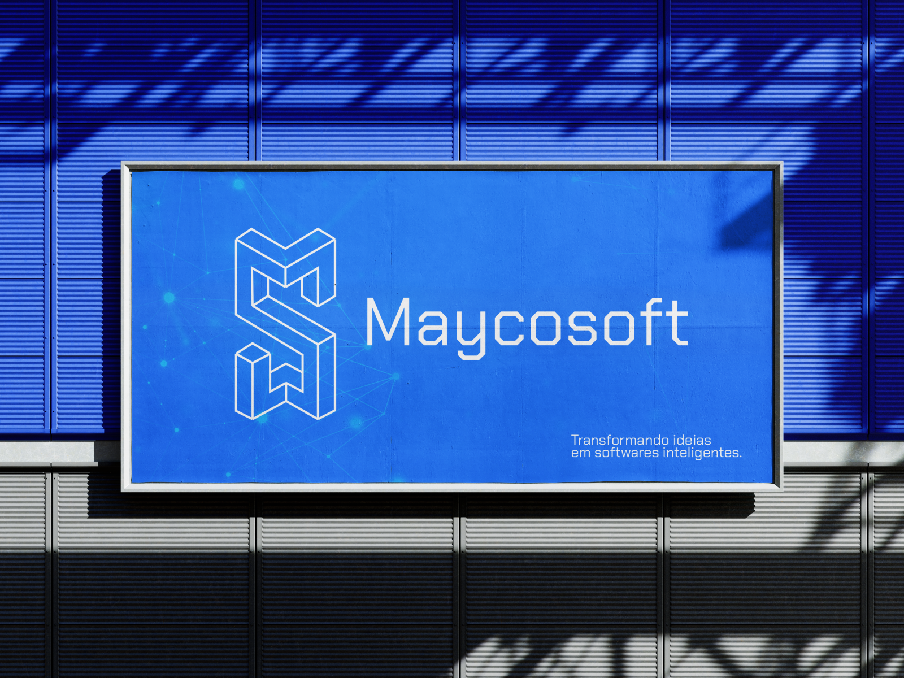

# Maycosoft - Repositório de Projetos

# 

Bem-vindo ao repositório oficial da **Maycosoft**! Aqui você encontrará projetos de desenvolvimento de software e design de interfaces de usuário (UI/UX), criados para transformar ideias em soluções digitais inovadoras.

## 🚀 Sobre a Maycosoft

Somos uma empresa especializada no desenvolvimento de softwares personalizados e design centrado no usuário. Nosso foco está em criar soluções tecnológicas que aliam funcionalidade e estética, proporcionando experiências digitais eficientes e intuitivas.

### Missão

Nossa missão é transformar ideias em soluções digitais inovadoras, combinando desenvolvimento de software com design para criar produtos que atendam às necessidades dos nossos clientes, sempre com foco na experiência do usuário.

### Slogan

"Inovação que transforma ideias em software."

## ⚙ Estrutura dos Projetos

Cada projeto desenvolvido pela Maycosoft segue a seguinte estrutura:

- `/nomeprojeto`: Diretório principal do projeto.
- `/assets`: Recursos visuais, como imagen

## 🤝 Colaboradores

<table>
  <tr>
    <td align="center">
      
       
      <b>Maycon Araújo</b> - ``M4ycosoft``
    </td>
    <td align="center">
      
       
      <b>Nome do Colaborador 1</b> - ``UsuarioGitHub1``
    </td>
    <td align="center">
      
       
      <b>Nome do Colaborador 2</b> - ``UsuarioGitHub2``
    </td>
    <td align="center">
      
       
      <b>Nome do Colaborador 3</b> - ``UsuarioGitHub3``
    </td>
    <td align="center">
      
       
      <b>Nome do Colaborador 4</b> - ``UsuarioGitHub4``
    </td>
  </tr>
</table>

