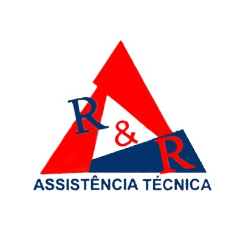

# Desenvolvimento de Interface para a R&R Assistência Técnica

# 

## Visão Geral
### O desafio
 Lorem Ipsum is simply dummy text of the printing and typesetting industry. Lorem Ipsum has been the industry's standard dummy text ever since the 1500s, when an unknown printer took a galley of type and scrambled it to make a type specimen book. It has survived not only five centuries, but also the leap into electronic typesetting, remaining essentially unchanged. It was popularised in the 1960s with the release of Letraset sheets containing Lorem Ipsum passages, and more recently with desktop publishing software like Aldus PageMaker including versions of Lorem Ipsum.

### Contexto

## Ciclo de vida
### Ciclo de vida estrela

## Analise de tarefas, usuários e função

## Storytelling

## WHO - Analise dos Stakeholders
### Perssonas

## Mapa de empatia

## 🤝 Colaboradores

<table>
  <tr>
    <td align="center">
      
       
      <b>Maycon Araújo</b> - <a href="https://github.com/M4yc" target="_blank">M4yc</a>
    </td>
    <td align="center">
      
       
      <b>Vanessa Campos</b> - <a href="https://github.com/Vanessab4rros" target="_blank">Vanessab4rros</a>
    </td>
    <td align="center">
      
       
      <b>Taís Moreira</b> - <a href="https://github.com/TaisMoreir" target="_blank">TaisMoreir</a>
    </td>
    <td align="center">
      
       
      <b>Luslene Soares</b> - <a href="https://github.com/luslene" target="_blank">luslene</a>
    </td>
    <td align="center">
      
       
      <b>Luiz Filipe Souza</b> - <a href="https://github.com/LuizFilipe16" target="_blank">LuizFilipe16</a>
    </td>
  </tr>
</table>
